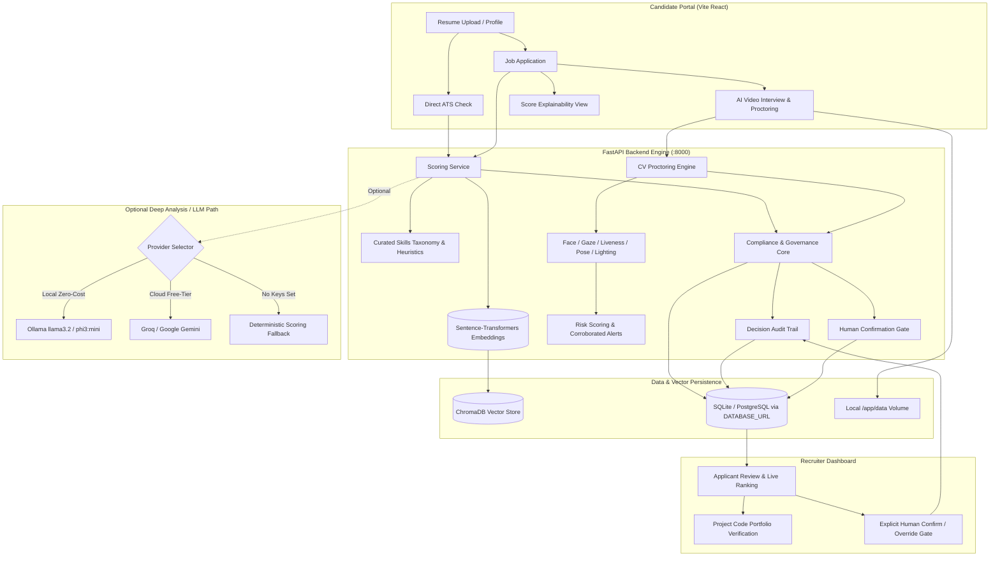

# ATS Platform

An AI-assisted, proctor-verified Applicant Tracking & Candidate Evaluation Platform with immutable decision audit logging, plain-language score explainability, multi-stage project verification, and real-time computer vision proctoring.

## ⚡ 5-Minute Zero-Cost Quickstart

The entire platform runs **100% locally with zero cloud API keys and zero paid dependencies** using local Ollama (or deterministic fallback scoring):

```bash
# 1. (Optional for local AI analysis) Start Ollama
ollama run llama3.2    # Or lightweight models: phi3:mini / qwen2.5:3b

# 2. Backend Setup
cd backend
python3 -m venv venv && source venv/bin/activate
pip install -r requirements.txt
pytest -v                               # Run test suite (79 tests)
uvicorn app.main:app --reload --port 8000

# 3. Frontend Setup (in a separate terminal)
cd frontend
npm install
npm run build                           # Verify production build
npm run dev                             # Start UI at http://localhost:5173
```

Open `http://localhost:5173` to explore the Candidate Portal, Recruiter Dashboard, and Admin Approval Queue.

---

## 🎥 Visual Walkthrough

```
+-----------------------------------------------------------------------------------+
|                            ATS PLATFORM DEMO WALKTHROUGH                          |
|                                                                                   |
|  [ Candidate Resume Upload ] --> [ Instant ATS Score ] --> [ Code Verification ]  |
|                                                                 |                 |
|                                                                 v                 |
|  [ Recruiter Audit Review ] <-- [ Human Confirmation ] <-- [ AI Spoken Interview ]|
+-----------------------------------------------------------------------------------+
```

> **Screen Recording Capture (macOS / Local)**:
> 1. Start the backend (`uvicorn app.main:app --port 8000`) and frontend (`npm run dev`).
> 2. Press `Cmd + Shift + 5` to record the screen: upload a resume, view the ATS dial & keyword breakdown, and review applicants in the recruiter dashboard.
> 3. Convert to GIF (`ffmpeg -i recording.mov -vf "fps=12,scale=800:-1:flags=lanczos" assets/demo_preview.gif`) and drop into `assets/demo_preview.gif`.

---

## 🏛️ System Architecture



---

## 📊 Feature Matrix

| Feature | Status | Verified Capabilities & Implementation Note |
|---|---|---|
| **Candidate ATS Scoring** | **Implemented** | Deterministic 2-stage scoring blending semantic embedding similarity (`all-MiniLM-L6-v2`), keyword taxonomy, and experience estimation in `scoring.py`. |
| **Company & Job Matching** | **Implemented** | Instant re-ranking of all applicants when recruiters update job descriptions without manual resync steps (`candidate_jobs.py` & `recruiter_jobs.py`). |
| **Recruiter Dashboard** | **Implemented** | Unified candidate review cards with blended ATS dials, code portfolio evaluation, and proctoring status badges (`UnifiedRecruiterCard.jsx`). |
| **AI Video Interview** | **Implemented** | Spoken speech recognition, TTS audio prompting, adaptive question progression, and exit-intent detection (`live-interview-room.tsx` & `interviewer.ts`). |
| **CV Proctoring & Risk Engine** | **Implemented** | Multi-signal behavioral anomaly scoring combining face count, gaze/head pose, shoulder visibility, lighting, and liveness (`risk-engine.ts`). |
| **Decision Audit Trail** | **Implemented** | Append-only, immutable `DecisionAuditLog` recording every scoring event, LLM output, candidate deletion, and human reviewer confirmation (`audit.py`). |
| **Candidate Explainability** | **Implemented** | Plain-language score breakdown (`/explainability`) detailing semantic fit, matched vs missing skills, and actionable improvement tips without extra LLM cost. |
| **Consent & Data Retention** | **Implemented** | Pre-interview consent disclosure modal, 30-day automated media retention purge (`retention.py`), and candidate right-to-be-forgotten deletion. |
| **Authentication & RBAC** | **Implemented** | JWT + bcrypt auth with strict role separation (`candidate`, `recruiter`, `admin`), rate limiting via `slowapi`, and recruiter company ownership enforcement. |

---

## 🔌 Verified API Examples

### 1. Check ATS Resume Score (`POST /api/candidate/ats-score`)
**Request** (`multipart/form-data`):
```http
POST /api/candidate/ats-score HTTP/1.1
Content-Type: multipart/form-data; boundary=----WebKitFormBoundary

------WebKitFormBoundary
Content-Disposition: form-data; name="file"; filename="resume.txt"
Content-Type: text/plain

Senior Backend Engineer with 5 years in Python, FastAPI, PostgreSQL, Docker, Redis.
------WebKitFormBoundary
Content-Disposition: form-data; name="job_description"

Senior Python Developer needed with FastAPI, PostgreSQL, Docker, and Redis experience.
------WebKitFormBoundary--
```
**Response** (`200 OK`):
```json
{
  "ats_score": 90,
  "semantic_similarity": 0.7552,
  "keyword_coverage": 1.0,
  "jd_has_recognized_skills": true,
  "experience_years": 5.0,
  "matched_skills": [
    "Docker",
    "FastAPI",
    "PostgreSQL",
    "Python",
    "Redis"
  ],
  "missing_skills": [],
  "resume_id": "doc_e7a812bc"
}
```

### 2. Candidate Score Explainability (`GET /api/candidate/jobs/applications/{app_id}/explainability`)
**Request**:
```http
GET /api/candidate/jobs/applications/12/explainability HTTP/1.1
Authorization: Bearer <jwt_token>
```
**Response** (`200 OK`):
```json
{
  "application_id": 12,
  "job_title": "Senior Python Backend Engineer",
  "ats_score": 90,
  "final_score": 89,
  "summary_verdict": "Strong Match",
  "summary_text": "Your resume demonstrates exceptional alignment with the core requirements for Senior Python Backend Engineer (90/100 match).",
  "matched_skills": ["Python", "FastAPI", "PostgreSQL", "Docker", "Redis"],
  "missing_skills": [],
  "components": [
    {
      "name": "Resume & Semantic Fit",
      "score": 90,
      "weight_description": "Initial ATS screening based on semantic similarity and core skill coverage.",
      "details": "Matched 5 of 5 recognized skills (100% skill coverage).",
      "status": "strong"
    },
    {
      "name": "Project & Code Verification",
      "score": 88,
      "weight_description": "60% of composite evaluation when project evidence is submitted.",
      "details": "Verified technical implementation depth and repository architecture.",
      "status": "strong"
    }
  ],
  "recommendations": [
    "Your application profile is well-rounded and meets all benchmark criteria."
  ],
  "human_review_status": "Confirmed",
  "human_reviewer": "recruiter@example.com"
}
```

### 3. Recruiter Applicants Review (`GET /api/recruiter/jobs/{job_id}/applicants`)
**Request**:
```http
GET /api/recruiter/jobs/4/applicants HTTP/1.1
Authorization: Bearer <jwt_token>
```
**Response** (`200 OK`):
```json
{
  "job_id": 4,
  "job_title": "Senior Python Backend Engineer",
  "applicant_count": 1,
  "applicants": [
    {
      "application_id": 12,
      "candidate_name": "Alice Dev",
      "ats_score": 90,
      "project_score": 88,
      "final_score": 89,
      "matched_skills": ["Python", "FastAPI", "PostgreSQL", "Docker"],
      "missing_skills": [],
      "status": "shortlisted",
      "pending_human_review": false,
      "human_reviewer": "recruiter@example.com",
      "human_decision_notes": "Strong Python & FastAPI background confirmed",
      "interview_status": "unlocked",
      "interview_risk_score": 0,
      "interview_risk_level": "low"
    }
  ]
}
```

---

## 📈 Evaluation Status & Calibration Notes

### Directional Sanity Calibration
To verify monotonic behavior and directional sensitivity across different engineering domains, the deterministic scoring engine (`sentence-transformers` + keyword taxonomy) was tested across 10 distinct resume/JD pairs:

| Domain / Scenario | Match Type | ATS Score | Semantic Similarity | Keyword Coverage | Result |
|---|---|---|---|---|---|
| **Software (Python/FastAPI)** | Strong | **90/100** | 75.5% | 100.0% | Strong match |
| **Mechanical (CAD/SolidWorks/FEA)** | Strong | **87/100** | 77.7% | 85.8% | Strong match |
| **Civil (Structural/ETABS/STAAD)** | Strong | **94/100** | 83.9% | 100.0% | Strong match |
| **ECE (VLSI/Verilog/FPGA)** | Strong | **95/100** | 88.1% | 97.5% | Strong match |
| **Data / ML (PyTorch/NLP)** | Strong | **85/100** | 81.7% | 75.7% | Strong match |
| **Civil Resume vs Software JD** | Weak / Mismatch | **19/100** | 32.3% | 15.0% | Clean separation |
| **Marketing Resume vs Mechanical JD**| Weak / Mismatch | **16/100** | 29.9% | 7.5% | Clean separation |
| **Sales Resume vs ECE VLSI JD** | Weak / Mismatch | **7/100** | 7.6% | 5.0% | Clean separation |
| **Software Resume vs Civil JD** | Weak / Mismatch | **17/100** | 29.6% | 10.0% | Clean separation |
| **Generic Resume vs Systems JD** | Weak / Mismatch | **8/100** | 13.8% | 0.0% | Clean separation |

**Summary**: Strong domain matches consistently land in the **85–95/100** range, while mismatched profiles score **7–19/100**, confirming clear directional monotonicity.

### Honest Scope & Limitations
- **No Formal Benchmark Dataset**: This platform has been directionally sanity-checked, but has **not** been benchmarked against a formal labeled precision/recall ground truth dataset. Establishing a standardized hiring evaluation benchmark remains explicit future work.
- **Proctoring Risk Thresholds**: Thresholds in `risk-engine.ts` are rule-based heuristics rather than statistical models trained on labeled cheating/spoofing video corpora. False positives are mitigated architecturally via **multi-signal corroboration** (isolated single-frame blinks or brief head movements never trigger high severity flags) and **mandatory human recruiter review** before any final action.

---

## 🧪 Test Suites

### Backend Tests (Pytest)
```bash
cd backend
backend/venv/bin/pytest -v
```
**Status**: 79 passed, 4 skipped (0 failures).

### Frontend Tests (Vitest)
```bash
cd frontend
npx vitest run
```
**Status**: 4 test files passed, 16 tests passed (0 failures).

### TypeScript Type-Check & Build
```bash
cd frontend
npx tsc --noEmit
npm run build
```
**Status**: 0 compiler errors, clean production bundle generated in `dist/`.
